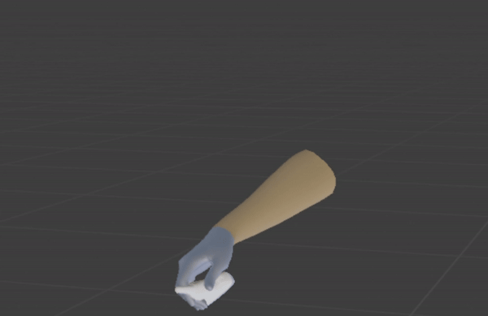
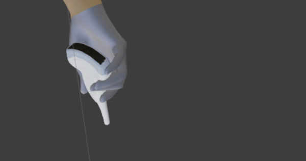
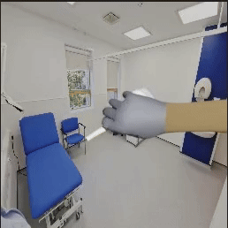

# HUP-3D: Rendering of 3D multi-view synthetic images for assisted-egocentric hand-ultrasound pose estimation



- [Project page](https://manuelbirlo.github.io/HUP-3D/) 
- [Synthetic Grasp Generation](https://github.com/BatFaceWayne/POV_Surgery)
- [Baseline repos](TBD)

This synthetic grasp image renderer is based on the [grasp renderer for surgical tool and hand pose estimation](https://github.com/jonashein/grasp_renderer), which in turn is based on the [ObMan dataset generation pipeline](https://github.com/hassony2/obman_render) that generates synthetic images of hands grasping everyday objects.
The synthetic grasps needed for this renderer can be generated with the [US_GrabNet_grasp_generation](TODO:provide final link).

Our synthetic dataset is available on the [project page](http://medicalaugmentedreality.org/handobject.html).

## Table of Content

- [Setup](#setup)
- [Demo](#demo)
- [Render grasps](#render-grasps)
- [Citations](#citations)

## Setup

### Optional: Use a Docker container

This repo is laid out for a Linux-based operating system. However, if you would like to use this repo with your Windows machine, a Docker containe is a suitable solution. Please follows our instructions here: [Docker container setup](./Docker/README.md)
Please note: It is also possible to use a Docker container on Mac, but we have not tested this repo on a Mac system with an Apple Silicon chip. We are only referring to the grab generation part of the forked POV-Surgery repo, which generates grab images using GrabNet, but the entire POV-Surgery pipeline renders grab images using Blender.
Newer Apple computers using the Silicon chip may be incompatible with Blender's OpenGL-related functionality.

### Clone repository (download the source code)

```sh
git clone [https://github.com/jonashein/grasp_renderer.git](https://github.com/manuelbirlo/HUP-3D_renderer.git
cd HUP-3D_renderer
```

### Download and install prerequisites

#### Download [Blender 2.82a](https://download.blender.org/release/Blender2.82/):
```sh
wget https://download.blender.org/release/Blender2.82/blender-2.82a-linux64.tar.xz
tar -xvf blender-2.82a-linux64.tar.xz
```

Install dependencies using pip:
```sh
wget https://bootstrap.pypa.io/get-pip.py
blender-2.82a-linux64/2.82/python/bin/python3.7m get-pip.py 
blender-2.82a-linux64/2.82/python/bin/pip install -r requirements.txt
```

#### Download assets from [SURREAL (Synthetic hUmans foR REAL tasks)](https://www.di.ens.fr/willow/research/surreal/data/):

- Go to SURREAL [dataset request page](https://www.di.ens.fr/willow/research/surreal/data/)
- Create an account, and receive an email with a username (= your email address) and password for data download
- Download SURREAL data dependencies using the following commands

```sh
cd assets/SURREAL
sh download_smpl_data.sh ../ your_username your_password
cd ..
```

#### Download [SMPL (A Skinned Multi-Person Linear)](http://smpl.is.tue.mpg.de/) Model

- Go to [SMPL website](http://smpl.is.tue.mpg.de/)
- Create an account by clicking *Sign Up* and provide your information
- Download and unzip `SMPL for Python users` (click on 'Download version <latest_version> for Python 2.7 (female/male/neutral, 300 shape PCs)' if you want the neutral human gender model to be included or on 'Download version <latest_version> for Python 2.7 (female/male. 10 shape PCs)' if you just want to use the male and female models), copy the content of the `models` folder (the .pkl files) to `assets/models`.  Note that all code and data from this download falls under the [SMPL license](http://smpl.is.tue.mpg.de/license_body). Please note: The current available downloads under 'SMPKL for Python users' don't contain two .fbx files that are required, they only contain .pkl files. Therefore, in order to allow a smooth installation process of this repo and still respect the SMPL licence, please download the .fbx file here AFTER you created a SMOL acount and accepted the SMPL licence: [link to .fbx files](https://drive.google.com/file/d/1NIGOLLJ8apfAMUY5ThS8xYCzFO3I72Ms/view?usp=sharing) 

#### Download body+hand textures and grasp information

- Request data on the [ObMan webpage](https://www.di.ens.fr/willow/research/obman/data/). 
  You should receive a link that will allow you to download `bodywithands.zip`.
- Download texture zips
- Unzip texture zip

```sh
cd assets/textures
mv path/to/downloaded/bodywithands.zip .
unzip bodywithands.zip
cd ../../
```

- Your structure should look like this:

```
grasp_renderer/
  assets/
    models/
      basicModel_f_lbs_10_207_0_v1.0.2.fbx
      basicModel_m_lbs_10_207_0_v1.0.2
      basicModel_f_lbs_10_207_0_v1.1.0.pkl
      basicModel_m_lbs_10_207_0_v1.1.0.pkl
      ...
   textures/
      bodywithhands/
        test/
           1_male_grey_male_0396.jpg
           3_female_grey_female_0691.jpg
           ...
        train/
           3_female_grey_female_0222.jpg
           3_female_grey_female_0630.jpg
           ...
        val/
          1_female_grey_female_0585.jpg
          1_female_grey_female_0696.jpg
          ...
```

#### Download [MANO](http://mano.is.tue.mpg.de/) model

- Go to [MANO website](http://mano.is.tue.mpg.de/)
- Create an account by clicking *Sign Up* and provide your information
- Download Models and Code (the downloaded file should have the format mano_v*_*.zip). Note that all code and data from this download falls under the [MANO license](http://mano.is.tue.mpg.de/license).
- unzip the file mano_v*_*.zip: `unzip mano_v*_*.zip` and place the unzipped 'mano_v*_*' folder for example to your project's asset directory (for example /root/HUP-3D_renderer/assets if your cloned repo is located in /root/HUP-3D_renderer/)
- set environment variable: `export MANO_LOCATION=/path/to/mano_v*_*` (for example  `export MANO_LOCATION=/root/HUP-3D_renderer/assets/mano_v1_2` if you've downloaded mano_v1_2 in the steps described above)

#### Modify mano code to be Python3 compatible

- Remove `print 'FINITO'` at the end of file `webuser/smpl_handpca_wrapper.py` (line 144)

```diff
-    print 'FINITO'
```

- Replace `import cPickle as pickle` by `import pickle`

```diff
-    import cPickle as pickle
+    import pickle
```

  - at top of `webuser/smpl_handpca_wrapper.py` (line 23)
  - at top of `webuser/serialization.py` (line 30)
- Fix pickle encoding
  - in `webuser/smpl_handpca_wrapper.py` (line 74)

```diff
-    smpl_data = pickle.load(open(fname_or_dict))
+    smpl_data = pickle.load(open(fname_or_dict, 'rb'), encoding='latin1')
```

  - in `webuser/serialization.py` (line 90)

```diff
-    dd = pickle.load(open(fname_or_dict))
+    dd = pickle.load(open(fname_or_dict, 'rb'), encoding='latin1')
```

- Fix model paths in `webuser/smpl_handpca_wrapper.py` (line 81-84)

```diff
-    with open('/is/ps2/dtzionas/mano/models/MANO_LEFT.pkl', 'rb') as f:
-        hand_l = load(f)
-    with open('/is/ps2/dtzionas/mano/models/MANO_RIGHT.pkl', 'rb') as f:
-        hand_r = load(f)
+    with open('/path/to/mano_v*_*/models/MANO_LEFT.pkl', 'rb') as f:
+        hand_l = load(f, encoding='latin1')
+    with open('/path/to/mano_v*_*/models/MANO_RIGHT.pkl', 'rb') as f:
+        hand_r = load(f, encoding='latin1')
```

At the time of writing the instructions mano version is 1.2 so use 

```diff
-    with open('/is/ps2/dtzionas/mano/models/MANO_LEFT.pkl', 'rb') as f:
-        hand_l = load(f)
-    with open('/is/ps2/dtzionas/mano/models/MANO_RIGHT.pkl', 'rb') as f:
-        hand_r = load(f)
+    with open('/path/to/mano_v1_2/models/MANO_LEFT.pkl', 'rb') as f:
+        hand_l = load(f, encoding='latin1')
+    with open('/path/to/mano_v1_2/models/MANO_RIGHT.pkl', 'rb') as f:
+        hand_r = load(f, encoding='latin1')
```


## Demo
<!-- We provide [exemplary grasps](assets/grasps/drill_grasps.txt) for the 3D drill model used in our synthetic and real datasets. -->
COMING SOON.

The 3D drill model can be downloaded [here](https://drive.google.com/file/d/1j3V2CTVEVPzI3Ybh159dfLtRXaoTqa00/view?usp=sharing).

Our synthetic dataset is available on the [project page](http://medicalaugmentedreality.org/handobject.html).

## Render Grasps

Before rendering grasps, grasps should have been generated using the GrabNet_Pose_Generation rep (TBN: use actual repo link here)
After grasps have been generated the resulting .mat files have to be copied into this repo, for example to the /assets/grasps folder. This repo provided six sample .mat files for easy testing (generate_1.mat, ..., generate_6.mat). 
Then the grasp rendering pipeline that launches Blender and renders images using our camera sphere concept can be executed as follows:

```
blender-2.82a-linux64/blender -noaudio -t 8 -P grasp_renderer.py -- '{"max_grasps_per_object": 2, "renderings_per_grasp": 1, "split": "train", "grasp_folder": "assets/grasps/", "backgrounds_path": "assets/backgrounds/", "results_root": "datasets/synthetic/", "use_grasps_from_mat_file": "True", "selected_grasps": {"generate_1.mat": [23,27]}}'
```
In the example execution of grasp_renderer.py above two grasps of generate_1.mat are used: 23 and 27. We recommend to visually inspect all generated grasps in a sofware like MeshLab and note down the indices of grasps you would like to be rendered. Again, in this case we selected grasps with indices 23 and 27 of generate_1.mat. 

## Citations

If you find this code useful for your research, please consider citing:

 TBD: Get actual citation
 
* the publication that this code was adapted for
```
@article{hein2021towards,
  title={Towards markerless surgical tool and hand pose estimation},
  author={Hein, Jonas and Seibold, Matthias and Bogo, Federica and Farshad, Mazda and Pollefeys, Marc and F{\"u}rnstahl, Philipp and Navab, Nassir},
  journal={International Journal of Computer Assisted Radiology and Surgery},
  volume={16},
  number={5},
  pages={799--808},
  year={2021},
  publisher={Springer}
}
```

* the publication it builds upon and that this code was originally developed for
```
@inproceedings{hasson19_obman,
  title     = {Learning joint reconstruction of hands and manipulated objects},
  author    = {Hasson, Yana and Varol, G{\"u}l and Tzionas, Dimitris and Kalevatykh, Igor and Black, Michael J. and Laptev, Ivan and Schmid, Cordelia},
  booktitle = {CVPR},
  year      = {2019}
}
```
